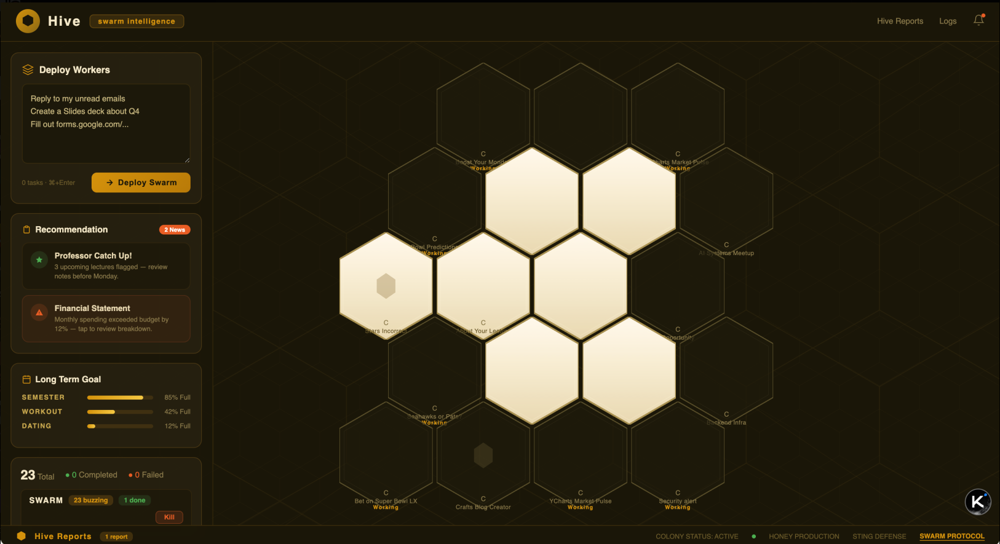

<p align="center">
  
</p>

<h1 align="center">Hivemind</h1>
<h3 align="center">Swarm Intelligence for Your Browser</h3>

<p align="center">
  
  
  
</p>

<p align="center">
  Deploy autonomous browser agents from your dashboard, voice, or iMessage. Hivemind classifies your intent, checks memory, and either answers instantly or deploys a coordinated swarm of agents across your real Chrome tabs.
</p>

<p align="center">
  
  
  
  
  
  
  
</p>

---

## Hackathon

This project was built in 24 hours at the **[Build with TRAE.ai & MiniMax Hackathon](https://hackathon-site-henna.vercel.app/)** hosted by BIA@USC on March 27-28, 2026 at the University of Southern California, Los Angeles.

- **Theme:** AI Agents for Productivity & Life Hacks
- **Tech Partners:** [TRAE AI](https://trae.ai), [MiniMax](https://minimax.io)
- **Track Partner:** [Photon](https://photon.codes) (iMessage integration bonus track)
- **Devpost:** [hivemind-swarm-intelligence-for-your-browser](https://devpost.com/software/hivemind-swarm-intelligence-for-your-browser)
- **Event:** [Luma registration page](https://luma.com/k5dc1l0d)

### Team

| Name | GitHub |
|------|--------|
| Felix Zhang | [@SSFelixzyk](https://github.com/SSFelixzyk) |
| Kevin Doshi | [@Kvndoshi](https://github.com/Kvndoshi) |
| Shuyi Zhan | |
| TengFei Huang | [@jasonyellow520](https://github.com/jasonyellow520) |

---

<p align="center">
  
</p>

<p align="center"><i>Agents deployed in parallel, each controlling a real Chrome tab. The hexagonal hive shows live agent status while the command bar accepts new tasks.</i></p>

<p align="center">
  <a href="https://youtu.be/eeQFg_CHCm4">
    
  </a>
</p>

---

## What is Hivemind?

Hivemind is an AI-powered browser orchestration system. Give it a task — by typing, speaking, or texting via iMessage — and it deploys a coordinated swarm of browser agents that work in parallel across your real Chrome tabs.

A **MiniMax M2.7 orchestrator** sits at the front of every input. It classifies intent, checks long-term memory (Supermemory RAG), and decides what to do:

- **Has the answer in memory?** Responds instantly.
- **Needs browser research?** Delegates to the **Queen (Gemini Pro)**, which decomposes the task and spawns parallel agents.
- **Just chatting?** Responds conversationally with full context of running tasks.
- **"Remember this"?** Saves to long-term memory via tool calling.

```
You:      "Compare AirPods Pro prices on Amazon vs Best Buy"
Hivemind: "Deploying 2 agents..."
           --> Agent 1: navigating Amazon.com
           --> Agent 2: navigating BestBuy.com
Hivemind: "Amazon: $189.99 (Prime) | Best Buy: $179.99 (open box)
           Best deal: Best Buy open-box saves $10"

You:      "Remember that Best Buy usually has the best open-box deals"
Hivemind: "Saved to memory."
```

---

## Features

### Unified Orchestrator (MiniMax + Gemini)
Every input — web dashboard, voice, iMessage, or Alt+Z chatbar — routes through a single MiniMax orchestrator. It uses tool calling to decide: answer from memory, save a fact, or delegate a browser task to the Queen. No mode toggles, no manual routing.

### Parallel Multi-Agent Swarm
The Queen (Gemini Pro) decomposes tasks into subtasks and spawns agents that run fully async and concurrently. Search flights on Google Flights, Expedia, and Kayak at the same time. Compare products across Amazon, Best Buy, and Walmart in a single prompt.

### Live Browser Control via CDP
Agents control your **real Chrome browser** through Chrome DevTools Protocol. They click, type, scroll, navigate, and read pages exactly like a human would — in your actual browser tabs where you can watch it live.

### Hexagonal Hive Dashboard
All Chrome tabs displayed as interactive hexagons on a visual canvas, clustered by domain. The Queen sits at the center. Click a hex to select, double-click to switch Chrome to that tab. Worker agents appear as orbiting nodes with real-time status.

### iMessage Integration (macOS)
Text your Hivemind from any iPhone. The iMessage bridge (via Photon Kit) receives messages, routes them through the MiniMax orchestrator, and texts back results. No app install required — works with your existing iMessage.

```
iMessage:  "What's the cheapest flight PHX to SFO tomorrow?"
Hivemind:  "Checking... deploying 3 agents"
Hivemind:  "Frontier $89 (basic), Southwest $127 (bags free),
            United $142 (1 stop). Best value: Southwest."
```

### Supermemory — Long-Term RAG Memory
Connected to [Supermemory](https://supermemory.com) for persistent memory. The orchestrator preloads relevant memories before every decision. Past search results, user preferences, saved facts — all available as RAG context. Ask "what flights did I search last week?" and get answers from memory without launching agents.

### Voice Commands
Click the microphone and speak naturally. Voice is transcribed via ElevenLabs STT and routed through the same unified orchestrator. Speak a task, get agents deployed.

### Alt+Z Chatbar (In-Browser)
Press `Alt+Z` in any Chrome tab to open a floating Hivemind chatbar. Submit tasks or save the current page to memory — without leaving the page you're on. Auto-injected into every new tab.

### Queen Narration
The Queen AI periodically narrates what agents are doing in plain language, broadcast as real-time WebSocket events. You always know what's happening without reading raw logs.

### Human-in-the-Loop Safety
Before any sensitive action — sending an email, submitting a form, making a purchase — agents pause and ask for explicit approval. You stay in control of every irreversible action.

### Agent Kill Switch
Kill any agent instantly from the dashboard. The Trash icon on agent nodes and the log panel gives you full control. Killed agents clean up their browser tabs automatically.

### Dual Browser Engine
- **Playwright** (default on Windows): Accessibility-tree agent via `aria_snapshot()`. Text-only, fast (~1-3s/step), ~4x fewer tokens.
- **browser-use**: Full vision-based agent with screenshots. Slower (~4-8s/step) but handles complex visual layouts.

---

## Architecture

```
                        ┌─────────────────┐
                        │   Input Sources  │
                        │                  │
                        │  Web Dashboard   │
                        │  Voice (STT)     │
                        │  iMessage Bridge │
                        │  Alt+Z Chatbar   │
                        └────────┬─────────┘
                                 │
                    ┌────────────▼────────────┐
                    │   MiniMax Orchestrator   │
                    │        (M2.7)            │
                    │                          │
                    │  - Intent classification │
                    │  - RAG memory preload    │
                    │  - Tool calling:         │
                    │    save_memory()         │
                    │    delegate_browser()    │
                    └──┬──────────┬────────────┘
                       │          │
              Direct reply   Delegates task
              (chat/memory)       │
                            ┌─────▼──────┐
                            │   Queen    │
                            │ (Gemini   │
                            │  3.1 Pro) │
                            └──┬──┬──┬──┘
                               │  │  │
                    ┌──────────┘  │  └──────────┐
                    │             │              │
               ┌────▼───┐  ┌────▼───┐    ┌────▼───┐
               │Agent 1 │  │Agent 2 │    │Agent N │
               │(Flash) │  │(Flash) │    │(Flash) │
               └────┬───┘  └────┬───┘    └────┬───┘
                    │           │              │
                    └─────┬─────┘──────────────┘
                          │  Chrome DevTools Protocol
                   ┌──────▼──────┐    ┌──────────────┐
                   │   Chrome    │    │ Supermemory   │
                   │  (Real      │    │  (Long-term   │
                   │   Browser)  │    │   RAG store)  │
                   └─────────────┘    └──────────────┘
```

---

## Quick Start

### Prerequisites

- Python 3.11+
- Node.js 18+
- Google Chrome

### 1. Clone

```bash
git clone https://github.com/jasonyellow520/hivemind.git
cd hivemind
```

### 2. Backend

```bash
cd backend
pip install -r requirements.txt
playwright install chromium
```

Create `.env` from the template:

```bash
cp .env.template .env
```

Fill in your API keys:

```env
GEMINI_API_KEY=your_gemini_key               # required — powers Queen + Workers
MINIMAX_API_KEY=your_minimax_key             # required — powers the orchestrator
SUPERMEMORY_API_KEY=your_supermemory_key     # optional — long-term memory
ELEVENLABS_API_KEY=your_elevenlabs_key       # optional — voice features
```

### 3. Start Chrome with CDP

**macOS:**
```bash
/Applications/Google\ Chrome.app/Contents/MacOS/Google\ Chrome --remote-debugging-port=9222 --remote-allow-origins=*
```

**Windows:**
```cmd
"C:\Program Files\Google\Chrome\Application\chrome.exe" --remote-debugging-port=9222 --remote-allow-origins=*
```

### 4. Run

From the project root:

```bash
python run.py
```

This starts both the backend (FastAPI on port 8081) and frontend (Vite on port 5173).

Open **http://localhost:5173** — Hivemind is ready.

---

## Usage

### Text Commands

Type anything into the command bar (`Ctrl+K` to focus):

| Prompt | What Happens |
|--------|-------------|
| `Find cheapest flights from PHX to SFO tomorrow` | Spawns agents on Google Flights, Expedia, Kayak |
| `Compare 34 inch monitors on Amazon` | Agent searches, extracts specs, returns comparison |
| `Summarize my unread Gmail and draft replies` | Agent opens Gmail, reads, drafts with approval |
| `Remember I prefer Southwest for domestic flights` | Saves to Supermemory for future context |
| `What flights did I search last week?` | Answers from memory without launching agents |

### Voice

Click the microphone icon and speak. Transcribed and routed through the orchestrator.

### iMessage (macOS)

Text your Hivemind from any iPhone. Requires the Photon iMessage Kit bridge running on macOS.

### Keyboard Shortcuts

| Key | Action |
|-----|--------|
| `Ctrl+K` | Focus command bar |
| `T` | Toggle tab panel |
| `L` | Toggle agent log panel |
| `G` | Fullscreen tab grid |
| `Alt+Z` | Toggle chatbar (in Chrome tabs) |
| `Escape` | Close overlays |

---

## Tech Stack

| Layer | Technology |
|-------|-----------|
| **Orchestrator** | MiniMax M2.7 (intent + RAG + tool calling) |
| **Task Planner** | Gemini 3.1 Pro (Queen — decomposition + synthesis) |
| **Agent LLM** | Gemini 3 Flash (Workers) |
| **Browser Automation** | Playwright (accessibility-tree) + browser-use (vision) via CDP |
| **Backend** | FastAPI, Python 3.11, asyncio, WebSockets, SSE |
| **Frontend** | React 19, TypeScript, Zustand, React Flow, Tailwind CSS |
| **Memory** | Supermemory (long-term RAG) |
| **Voice** | ElevenLabs STT + Web Audio |
| **iMessage** | Photon iMessage Kit (macOS bridge) |
| **Real-time** | WebSocket events + SSE streaming |
| **Dev Tools** | TRAE AI (vibe coding / rapid prototyping) |

---

## API Endpoints

| Method | Endpoint | Description |
|--------|----------|-------------|
| `POST` | `/api/v1/input/` | Unified input — all commands route here (SSE stream) |
| `POST` | `/api/v1/tasks/submit` | Direct task submission (legacy) |
| `GET` | `/api/v1/tabs/scan` | Scan Chrome tabs via CDP |
| `GET` | `/api/v1/tabs/:id/screenshot` | Get tab screenshot |
| `POST` | `/api/v1/voice/transcribe` | Transcribe voice to text |
| `POST` | `/api/v1/memory/save` | Save to Supermemory |
| `POST` | `/api/v1/memory/search` | Search memory |
| `DELETE` | `/api/v1/agents/:id` | Kill a running agent |
| `WS` | `/ws` | Real-time event stream |

---

## Project Structure

```
hivemind/
├── backend/
│   ├── main.py                     # FastAPI app + lifespan
│   ├── run.py                      # Entry point (uvicorn)
│   ├── config.py                   # Configuration
│   ├── mind/
│   │   ├── orchestrator.py         # MiniMax unified orchestrator
│   │   ├── queen.py                # Gemini task decomposition
│   │   ├── worker.py               # Agent execution loop
│   │   ├── memory.py               # Shared ephemeral memory
│   │   └── sensitive.py            # HITL action detection
│   ├── services/
│   │   ├── minimax_client.py       # MiniMax LLM client
│   │   ├── browser_manager.py      # Dual engine agent lifecycle
│   │   ├── playwright_agent.py     # Accessibility-tree browser agent
│   │   ├── tab_manager.py          # CDP tab scanning + management
│   │   ├── supermemory_service.py  # Long-term memory (RAG)
│   │   ├── imessage_sender.py      # iMessage outbound (macOS)
│   │   ├── elevenlabs_service.py   # TTS + STT
│   │   └── websocket_manager.py    # WS broadcast
│   ├── routers/
│   │   ├── input.py                # Unified input endpoint
│   │   ├── tasks.py                # Task submission
│   │   ├── tabs.py                 # Tab CRUD + screenshots
│   │   ├── imessage.py             # iMessage bridge
│   │   ├── voice.py                # Voice transcription
│   │   ├── memory.py               # Memory save/search
│   │   └── agents.py               # Agent control + kill
│   └── requirements.txt
├── frontend/
│   ├── src/
│   │   ├── App.tsx
│   │   ├── store/
│   │   │   ├── useMindStore.ts     # Zustand state
│   │   │   └── useWebSocket.ts     # WS event handler
│   │   └── components/
│   │       ├── Dashboard/
│   │       │   ├── CommandBar.tsx   # Unified input + voice
│   │       │   └── AgentLogPanel.tsx
│   │       ├── MindMap/
│   │       │   ├── HiveGraph.tsx    # React Flow hex canvas
│   │       │   ├── TabNode.tsx      # Hexagon tab node
│   │       │   └── WorkerNode.tsx   # Agent node
│   │       └── Tabs/
│   │           ├── TabPanel.tsx
│   │           └── TabGridPanel.tsx
│   └── vite.config.ts
├── run.py                          # Launches backend + frontend
└── README.md
```

---

## License

MIT

---

<p align="center">
  <b>One command. A swarm of agents. Your browser, orchestrated.</b>
</p>
